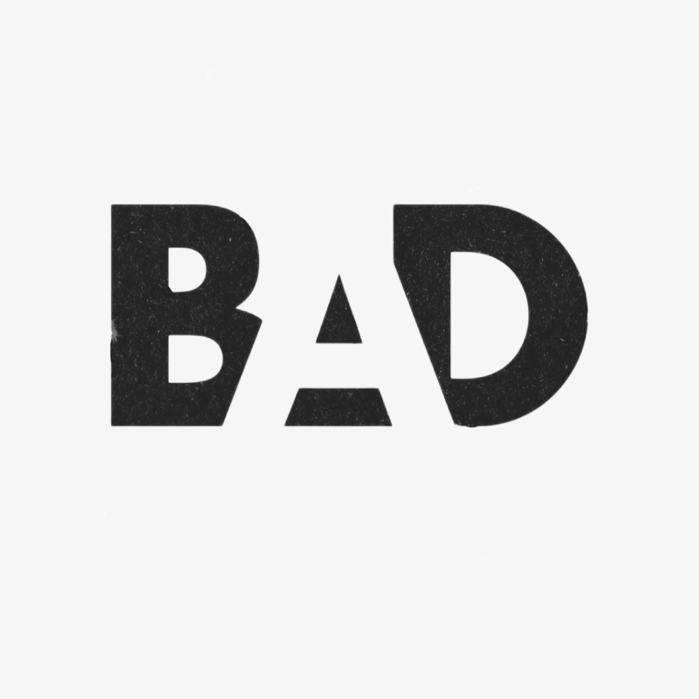

# 🟢Yomon So‘zlar Arxivi - Senzura Qiluvchi Platforma

Yomon So‘zlar Arxivi, o'zbek tilidagi nojo'ya so'zlarni senzuradan o'tkazish uchun mo'ljallangan platforma.

### Disclaimer⚠️
🔞Bu loyihada ko'plab haqoratli so'zlar mavjud bo'lishi mumkin. Ushbu so'zlar faqat o'zbek tilidagi nojo'ya so'zlar ro'yxatidan olingan. Ushbu so'zlar faqat ma'lumotlar olish maqsadida ishlatiladi va ularni ishlatishdan kelib chiqadigan huquqiy javobgarlik sizga tegishli bo'lishi mumkin.
18 yoshdan kichiklar uchun bu loyiha tavsiya etilmaydi.

## Maqsad
Bu loyiha o'zbek tilidagi nojo'ya so'zlarni aniqlash va ularni platformadan olib tashlash maqsadida yaratilgan.

## Resurslar
- [MilliyTech](https://milliytech.uz) - MilliyTech sayti
- [Telegram](https://t.me/jakhangir_blog) - Telegram kanal
- [Bad](https://bad.milliytech.uz) - Yomon so'zlar platformasi
- [Bad API](https://api.badwords.milliytech.uz/api/v1/badword/) - Yomon so'zlar platformasi API

**CSV, JSON, XLSX** formatlarida yomon so'zlar ro'yxati:

| No   | So'zlar                          | Turi    | Holati  |
|------|----------------------------------|---------|---------|
| 1    | [CSV](resources/bad_words.csv)   | CSV     | ✅      |
| 2    | [JSON](resources/bad_words.json) | JSON    | ✅      |
| 3    | [XLSX](resources/bad_words.xlsx) | XLSX    | ✅      |

## Qanday foydalanish
Loyihani ishlatish uchun quyidagi ko'rsatmalarga amal qiling:

1. **Yuklab oling**: Loyiha fayllarini yuklab oling yoki klon qiling.
2. **O'rnating**: Zaruriy bog'lamalarni o'rnating va loyiha fayllarini tayyorlang.
3. **Ishga tushiring**: Loyihani ishga tushiring va nojo'ya so'zlarni aniqlashni boshlang.

## Hissa qo'shish
Agar loyihaga hissa qo'shmoqchi bo'lsangiz, quyidagi qadamlarni bajaring:

1. **Fork**: Loyiha repositorysini fork qiling.
2. **Branch**: Yangi branch yarating (`git checkout -b feature-branch`).
3. **O'zgarishlar**: Zaruriy o'zgarishlarni kiriting va commit qiling (`git commit -m 'Add some feature'`).
4. **Pull Request**: Pull request yarating va loyihaga qo'shing.
5. **So'z qo'shish**: https://bad.milliytech.uz/ saytiga kirib, so'z qo'shing va u so'z chindan ham yomon so'z deb qoshilsa tez orada platformaga qo'shiladi.

## Litsenziya
Bu loyiha [MIT Litsenziyasi](LICENSE) ostida tarqatiladi.

## Aloqa
Agar sizda savollar yoki takliflar bo'lsa, iltimos, [Telegram](https://t.me/ja_khan_gir) orqali bog'laning.

---

**Diqqat**: Bu loyiha hali rivojlanish bosqichida va ba'zi funksiyalar to'liq ishga tushirilmagan bo'lishi mumkin.